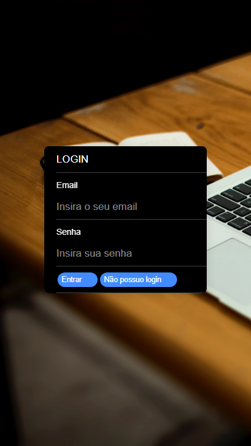
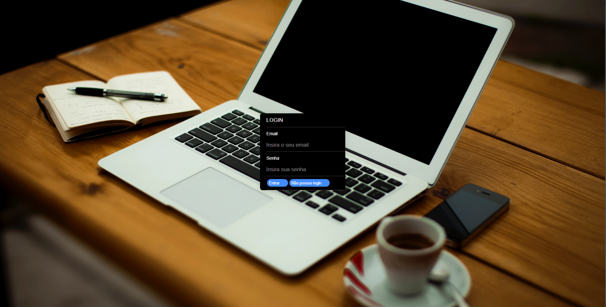
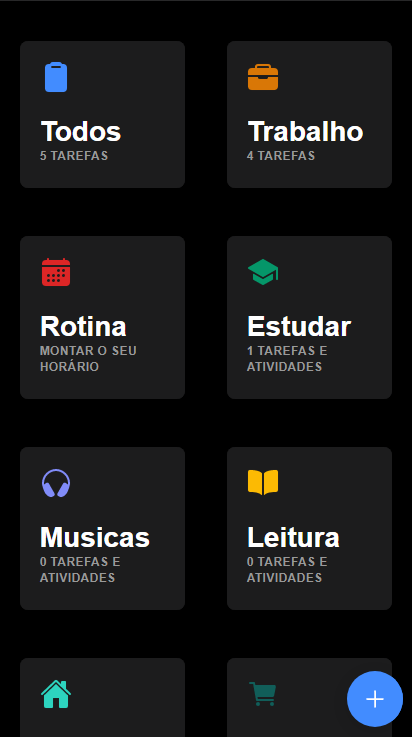

# To do List and Organization App with Ionic and Firebase (PT-BR / EN)

## What the app will have?
- Marcar o tipo de Tarefa / Mark the task type
- Criação de Tarefas / Create the Task
- Tempo limite / DeadLine  
- Dark mode 
- Excluir e marcar como concluido / Delete and mark as done
- Ver as tarefas por tipo / See the task by type
- Tentar criar um horario / Try to create the schedule
- Criar uma autenticação / Try to create authentication 

## Why Ionic and Firebase?
Tentando aprender uma tecnologia nova e ver no que dá. Estarei fazendo esse protótipo pois uso no dia a dia várias ferramentas, e farei em um só. 

Trying to learn a new technology and see how it goes. I'll try to build this because I use some plataforms, and I will combine in one. 

### References

- [Local Storage](https://blog.logrocket.com/the-complete-guide-to-using-localstorage-in-javascript-apps-ba44edb53a36/)
- [MDN](https://developer.mozilla.org/en-US/)
- [Design Ideas](https://dribbble.com/tags/calendar)
- [how-to-enable-dark-mode-on-your-website-with-pure-css](https://medium.com/js-dojo/how-to-enable-dark-mode-on-your-website-with-pure-css-32640335474) 
- [a-complete-guide-to-dark-mode-on-the-web/](https://css-tricks.com/a-complete-guide-to-dark-mode-on-the-web/)
- [https://codepen.io/demilad/pen/bZRjpb](https://codepen.io/demilad/pen/bZRjpb)
- [Colors](https://dribbble.com/shots/14590159--Meeting-Modal-Creator)

# How start? Como começar?
- [Ionic](https://ionicframework.com)
- [Ionic + Vue | Angular | React ](https://ionicframework.com/start#basics)

# Prints
### Mobile Login

### Desktop Login

### List 

## License

Developed by [Bruno Gomes](https://github.com/brunogomes98)
